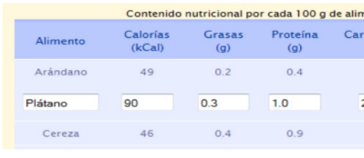

Dada la aplicación `tabla.html`, se pide que al pulsar en el texto **Editar** de la columna **Acciones**, ocurra lo siguiente:

* El texto de esa columna que ponía `<<Editar>>` en color azul, será reemplazado por el texto `<<En edición>>` en color gris o negro.

* Los datos en la fila correspondiente se convertirán en casillas de texto editables de modo que el usuario pueda modificar los datos de esa fila.

* Debe aparecer en la parte inferior de la tabla el texto:
  `<<Pulse Aceptar para guardar los cambios o cancelar para anularlos>>`
  y dos botones: **Aceptar** y **Cancelar**, que podrán ser pulsados por el usuario para aceptar los cambios o para cancelar.

Si el usuario pulsa en el botón **Aceptar**, los datos de la fila en edición deben ser enviados a una URL de destino por el método **GET**.
Por ejemplo, si la URL de destino es `aprenderaprogramar.com` y editáramos la fila correspondiente a **Fresa** y pulsamos aceptar, el navegador debe enviarnos a una URL como esta:

```
http://192.168.0.1/?alimento=Fresa&calorias=57&grasas=1.5&proteina=0.4&carbohidratos=12.8
```

Tener en cuenta que los datos que se deben enviar a la URL de destino son los datos **editados por el usuario**, no los datos originales de la tabla.

* Si el usuario pulsa en **Cancelar**, se recargará la tabla original (de forma que no habrá ninguna fila en edición).

* Si estando seleccionada una fila en edición el usuario pulsa sobre **Editar** en otra fila, se mostrará un mensaje indicando lo siguiente:

  > “Solo se puede editar una línea. Recargue la página para poder editar otra”.

* La siguiente imagen refleja la idea de lo que se quiere conseguir:
  **editar campos tabla javascript**: 


* **Nota:**
  Se supone que la tabla va a cargar datos desde una base de datos, pero como nuestro objetivo no es el manejo de bases de datos ni de lenguajes del lado del servidor sino ver aplicaciones de JavaScript, por ello la tabla se os facilita con el código HTML necesario.

---

### Ayuda para resolver el ejercicio

1. Crea una variable global de nombre `editando` y tipo booleano que te permita saber si se encuentra en edición alguna fila o no.

2. Crea una función:

   ```
   function transformarEnEditable(nodo)
   ```

   que debe encargarse de transformar en editables los datos de una fila definiéndolos en etiquetas `<input> ... </input>` usando `innerHTML`.
   Además, debe añadir el texto:

   ```
   Pulse Aceptar para guardar los cambios o cancelar para anularlos
   ```

   y los dos botones: **Aceptar** y **Cancelar**.

   Si ya había una fila en edición, en lugar de estos se deberá mostrar el mensaje:

   ```
   Solo se puede editar una línea, cancele o recargue la página para poder editar otra
   ```

3. Crea una función:

   ```
   function capturarEnvio()
   ```

   que sirva para que cuando el usuario pulse el botón **Aceptar**, se cree un formulario con datos ocultos (`hidden`) capturados de las casillas de la fila en edición y se envíen a la URL de destino por el método **GET**.

   El formulario lo añadirás con `innerHTML` y el envío lo puedes realizar con la sentencia JavaScript:

   ```
   document.nombreDelformulario.submit();
   ```

4. Crea la función **anular** que recargue la página original cuando el usuario pulse el botón **Cancelar**.
   Esto puedes hacerlo con la sentencia JavaScript:

   ```
   window.location.reload();
   ```